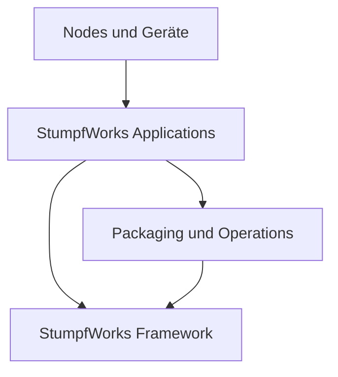
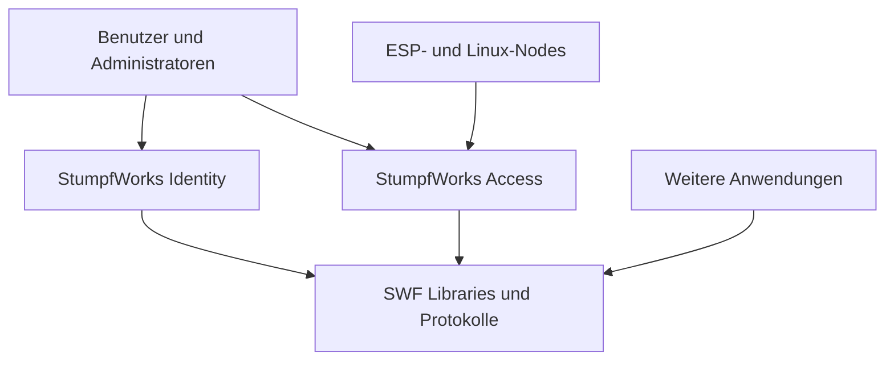
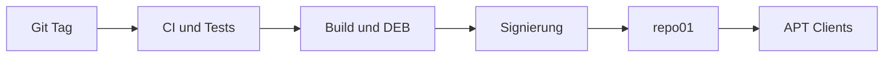

# StumpfWorks Framework

## Masterplan und Architecture Decision Document

**Dokumentstatus:** Initialer Architekturentwurf  
**Version:** 0.1  
**Startdatum:** 12. September 2026  
**Verantwortlich:** StumpfWorks / Sebastian Stumpf  
**Repository:** `stumpfworks-framework`  
**Lizenzziel:** Open Source und vollständig self-hostbar

---

## 1. Zweck des Dokuments

Dieses Dokument ist die verbindliche technische Ausgangsbasis für das StumpfWorks Framework (SWF). Es beschreibt Zielbild, Grenzen, Module, Sicherheitsmodell, Versionsstrategie, Entwicklungsphasen und die spätere Migration von StumpfWorks Identity und StumpfWorks Access.

Das Dokument soll verhindern, dass das Framework zu einer unübersichtlichen Sammlung beliebiger Hilfsfunktionen wird. Architekturänderungen dürfen vorgenommen werden, müssen aber als Architecture Decision Record (ADR) nachvollziehbar dokumentiert werden.

## 2. Vision

Das StumpfWorks Framework bildet die gemeinsame technische Plattform für eigenständige StumpfWorks-Anwendungen. Es ersetzt weder Go noch React und ist kein universelles Konkurrenzprodukt zu etablierten Webframeworks. Es standardisiert die Bausteine, die in mehreren StumpfWorks-Projekten wiederkehren.

Das Zielbild besteht aus drei Ebenen:

1. **StumpfWorks Framework:** Wiederverwendbare Backend-, Security-, Identity-, Geräte- und Betriebsbausteine.
2. **StumpfWorks Applications:** Eigenständige Produkte wie Identity, Access, AlertHub und NAS.
3. **StumpfWorks Platform Operations:** Pakete, APT-Repository, Installer, Updates und später StumpfWorks Debian.



## 3. Ziele

Das Framework soll:

- wiederkehrenden Infrastrukturcode zentral und getestet bereitstellen;
- sichere Standardeinstellungen erzwingen;
- Anwendungen weiterhin unabhängig deploybar und versionierbar halten;
- Identity als gemeinsamen Identitätsanbieter integrieren;
- ein gemeinsames Geräteprotokoll für ESP8266, ESP32 und spätere Nodes schaffen;
- einheitliche Konfiguration, Logs, Fehler, Healthchecks, Audit Events und Updates ermöglichen;
- stabile, dokumentierte APIs anbieten;
- vollständig ohne StumpfWorks-Cloud betrieben werden können;
- Debian-Pakete, reproduzierbare Releases und einen eigenen APT-Kanal unterstützen.

## 4. Nicht-Ziele

In der ersten Generation wird ausdrücklich nicht versucht:

- Go durch eine eigene Programmiersprache oder Runtime zu ersetzen;
- alle bestehenden Anwendungen sofort zu migrieren;
- ein allgemeines Framework für fremde beliebige Software-Ökosysteme zu bauen;
- Microservices zu erzwingen;
- Kubernetes vorauszusetzen;
- eine zentrale von StumpfWorks betriebene Cloud zu benötigen;
- RettConnect vollständig oder ungetestet auf SWF umzustellen;
- bereits in SWF 0.1 Kameraerkennung, OTA, Passkeys und sämtliche IoT-Funktionen zu liefern.

## 5. Architekturprinzipien

### 5.1 Anwendungen bleiben eigenständig

Identity, Access, AlertHub und andere Produkte behalten eigene Repositories, Releases, Datenbanken und Fachlogik. Das Framework darf keine Anwendung in einen gemeinsamen Monolithen zwingen.

### 5.2 Modularer Monorepo-Start für das Framework

SWF beginnt als ein Go-Modul in einem Repository. Interne Pakete werden sauber getrennt, aber nicht voreilig in zahlreiche Repositories oder Go-Module zerlegt. Eine spätere Trennung erfolgt nur bei einem konkreten technischen Grund.

### 5.3 Explizite Abhängigkeiten

Module erhalten benötigte Ressourcen über Konstruktoren beziehungsweise Dependency Injection. Globale veränderliche Zustände und versteckte Singletons sind zu vermeiden.

### 5.4 Sichere Standardwerte

Unsichere Funktionen müssen bewusst aktiviert werden. Security Header, Zeitlimits, Größenlimits, sichere Cookie-Einstellungen, Secret-Redaction und kontrolliertes Herunterfahren gehören zum Standard.

### 5.5 Schnittstellen an den Rändern

Fachlogik hängt nicht unmittelbar von PostgreSQL, HTTP-Routern, MQTT oder konkreten Identity-Implementierungen ab. Kleine Interfaces werden dort definiert, wo sie verwendet werden.

### 5.6 Keine Abstraktion ohne echten Consumer

Ein Baustein wird erst in SWF aufgenommen, wenn er von mindestens einer echten Anwendung benötigt wird und mit einer zweiten Verwendung plausibel wiederverwendbar ist. Identity und Access dienen als Architekturtests.

### 5.7 Open Source und self-hosted first

Alle Kernfunktionen müssen lokal betreibbar sein. Externe Dienste dürfen optionale Adapter sein, aber keine Pflicht.

## 6. Systemkontext



Identity bleibt die fachliche Quelle für Benutzeridentitäten, Anmeldungen, Badges und zentrale Autorisierungsinformationen. SWF liefert dafür Protokolle, Middleware und SDKs. Access besitzt weiterhin Zutrittsregeln, Tore, Türen, RFID-Zuordnungen und Geräteaktionen.

## 7. Zielarchitektur und Schichten

### 7.1 Core

Grundlage jeder Anwendung:

- Application Lifecycle und kontrolliertes Herunterfahren
- Konfigurationsschema und Validierung
- strukturiertes Logging
- standardisierte Fehler
- Build-, Versions- und Releaseinformationen
- Clock-, ID- und grundlegende Utility-Interfaces

### 7.2 Web

- HTTP-Server mit Timeouts und Limits
- Routing-Integration
- Request IDs und Correlation IDs
- Recovery, sichere Header und CORS-Konfiguration
- einheitliche JSON-Antworten und Problem Details
- Eingabevalidierung
- Auth- und Audit-Middleware

### 7.3 Data

- PostgreSQL Connection Pool
- Transaktionshelfer
- Migrations-Lifecycle
- Readiness-Prüfungen
- optional später Cache- und Object-Storage-Adapter

SWF liefert keine universelle ORM-Schicht. Anwendungen behalten eigene Queries und Repositories.

### 7.4 Security

- Secret-Redaction und Secret-Quellen
- kryptografisch sichere IDs und Tokens
- Passwort-/Token-Helfer nur mit geprüften Algorithmen
- Rate Limiting
- sichere HTTP-Defaults
- Signaturprüfung für Artefakte und Updates
- Security Events

Eigene Kryptografiealgorithmen sind verboten. SWF kapselt ausschließlich etablierte Bibliotheken und Protokolle.

### 7.5 Identity und Authorization

- Identity Client Registration
- Tokenvalidierung und Key Rotation
- Sessions und Service Accounts
- RBAC-Bausteine und Permission Checks
- MFA- und Passkey-Schnittstellen
- Machine- und Device-Authentifizierung

Identity-spezifische Benutzerverwaltung verbleibt in StumpfWorks Identity.

### 7.6 Audit

- unveränderliches Audit-Event-Modell
- Actor, Action, Resource, Result, Timestamp und Correlation ID
- sensible Felder werden nicht ungefiltert protokolliert
- Adapter für PostgreSQL und spätere Exporte
- verbindliche Events für sicherheitsrelevante Aktionen

### 7.7 Events und Kommunikation

- typisierte interne Domain Events
- Outbox-Grundlage für zuverlässige externe Zustellung
- Webhooks mit Signaturen, Retry und Idempotenz
- WebSocket/SSE-Adapter bei Bedarf
- später Mail-, Notify- und weitere Benachrichtigungsadapter

### 7.8 Device SDK und Device Protocol

- Pairing und Registrierung
- gerätespezifische Schlüssel
- Heartbeat und Last Seen
- Capabilities
- Telemetrie und Events
- Commands mit ID, Ablaufzeit und Ergebnis
- Konfigurationsversionierung
- später signierte Firmware-Updates

Der ESP8266 wird wegen seiner Grenzen nicht gezwungen, den vollständigen Server-SDK-Code zu verwenden. Das Protokoll bleibt gemeinsam; Implementierungen sind plattformspezifisch.

### 7.9 Observability

- Liveness und Readiness
- strukturierte Logs
- Prometheus-kompatible Metriken
- optionale Traces
- privacy-safe Diagnostics mit ausdrücklicher Aktivierung

### 7.10 Update und Release

- signierte Release-Manifeste
- stabile Release-Channels
- Integritätsprüfung
- kontrollierte Rollbacks
- Update-Status und Audit Events

## 8. Vorgesehene Repository-Struktur

```text
stumpfworks-framework/
├── cmd/
│   └── swf/                    # spätere Entwickler-CLI
├── core/
│   ├── app/
│   ├── config/
│   ├── errors/
│   ├── logging/
│   └── version/
├── web/
│   ├── middleware/
│   ├── problem/
│   ├── server/
│   └── validation/
├── data/
│   ├── postgres/
│   └── migrate/
├── security/
├── audit/
├── auth/
├── rbac/
├── events/
├── devices/
├── updates/
├── observe/
├── internal/                   # nicht öffentliche Implementierungsdetails
├── examples/
│   └── minimal-app/
├── docs/
│   ├── ARCHITECTURE.md
│   ├── SECURITY.md
│   ├── ROADMAP.md
│   └── adr/
├── test/
│   └── integration/
├── .github/
│   └── workflows/
├── go.mod
├── LICENSE
├── README.md
└── CONTRIBUTING.md
```

Öffentliche Pakete müssen absichtlich klein bleiben. Was kein stabiler Bestandteil der API sein soll, gehört nach `internal/`.

## 9. Minimale öffentliche API für SWF 0.1

Die konkrete Go-API wird beim Implementieren validiert. Das gewünschte Nutzungsbild ist:

```go
application, err := app.New(app.Options{
    Name:    "example",
    Version: build.Version,
})
if err != nil {
    return err
}

application.Use(database)
application.Use(auditStore)
application.Handle("GET /health/live", health.Live())
application.Handle("GET /health/ready", health.Ready(database))

return application.Run(ctx)
```

Diese API ist ein Zielbild, kein vorab eingefrorener Vertrag. SWF 0.x darf aufgrund echter Erfahrungen angepasst werden.

## 10. Konfiguration

Priorität der Quellen:

1. sichere fest codierte Defaults;
2. Konfigurationsdatei;
3. Umgebungsvariablen;
4. explizite Kommandozeilenargumente.

Regeln:

- beim Start vollständig validieren und bei Fehlern eindeutig abbrechen;
- Secrets nicht in normale Konfigurationsausgaben oder Logs schreiben;
- keine versteckten Defaults für sicherheitskritische Schlüssel;
- dokumentierte Environment-Namensräume, beispielsweise `SWF_HTTP_*`;
- Reload nur dort anbieten, wo Verhalten und Thread-Sicherheit definiert sind.

## 11. Fehler- und API-Modell

Interne Fehler und öffentliche Antworten sind getrennt. HTTP-Antworten folgen einem einheitlichen Problem-Details-Modell und enthalten eine Correlation ID, aber keine Stacktraces, SQL-Fehler oder Secrets.

Beispiel:

```json
{
  "type": "https://docs.stumpfworks.de/problems/validation",
  "title": "Validation failed",
  "status": 400,
  "code": "validation_failed",
  "correlation_id": "01...",
  "errors": []
}
```

## 12. Datenhaltung und Mandantenfähigkeit

SWF stellt technische Bausteine bereit, entscheidet aber nicht pauschal über die Mandantenstrategie jeder Anwendung.

- Identity und Access dokumentieren ihr eigenes Tenant-Modell.
- Transaktionen werden explizit gesteuert.
- Migrationen sind versioniert, vorwärts testbar und mit Upgrade-Hinweisen versehen.
- Backups und Restore-Tests gehören zur Betriebsdokumentation.
- RettConnect behält wegen Patientendaten und Datenbank-pro-Tenant zunächst seine strengere eigene Architektur.

## 13. Security Baseline

Vor einem produktiven 1.0-Release gelten mindestens folgende Anforderungen:

- Threat Model für Core, Auth, Updates und Device Pairing;
- Schutz vor Token Replay und Brute Force;
- Rotation von Signatur- und Geräteschlüsseln;
- TLS an allen externen Grenzen;
- keine Secrets in Git, Logs, Diagnostics oder Images;
- Dependency- und Vulnerability-Scans in CI;
- SBOM je Release;
- reproduzierbare beziehungsweise nachvollziehbare Builds;
- signierte Tags, Artefakte und APT-Metadaten;
- dokumentierter Security- und Disclosure-Prozess;
- negative Tests für Auth, Authorization und Tenant Isolation.

## 14. Teststrategie

Jedes öffentliche Modul benötigt:

- Unit Tests für Verhalten und Fehlerfälle;
- Integrationstests für PostgreSQL beziehungsweise externe Adapter;
- Race-Tests für nebenläufigen Go-Code;
- API-/Contract-Tests zwischen SWF und Anwendungen;
- Migrations- und Upgrade-Tests;
- Security-Regressionstests;
- Beispielanwendung als ausführbaren Smoke Test.

CI-Mindestprüfungen:

```text
format → vet/lint → unit → race → integration → vulnerability scan → build
```

Coverage ist ein Hinweis, kein Selbstzweck. Kritische Security- und Lifecycle-Pfade müssen vollständig durch Tests abgedeckt sein.

## 15. Versionierung und Kompatibilität

SWF verwendet Semantic Versioning.

- `0.x`: öffentliche APIs dürfen sich ändern; Änderungen werden dokumentiert.
- `1.x`: kompatible Weiterentwicklung; Breaking Changes nur in einer neuen Major-Version.
- Anwendungen pinnen eine konkrete kompatible Framework-Version.
- Deprecations werden vor Entfernung angekündigt und mit Migrationshinweisen versehen.

Geplante Stufen:

| Version | Inhalt | Abnahmekriterium |
|---|---|---|
| 0.1 | Core, Config, Logging, HTTP, Health, PostgreSQL, Migration, Audit-Basis | Minimal-App startet und beendet sich sauber |
| 0.2 | stabile Fehler/API-Konventionen, Security Defaults, Observability | erster Identity-Teil nutzt SWF |
| 0.3 | Identity Client, Tokenvalidierung, Sessions | Identity-2.0-Integration Ende-zu-Ende |
| 0.4 | RBAC, Permissions, erweitertes Audit | geschützte Beispiel-API mit Audit |
| 0.5 | Events, Outbox und Webhooks | zuverlässiger Event-Test |
| 0.6 | Device Protocol und Server SDK | Access-Node Pairing und Heartbeat |
| 0.7 | signierte Updates und Channels | verifiziertes Test-Update |
| 0.8 | Metrics, Diagnostics und Hardening | Betriebs- und Security-Checks erfüllt |
| 0.9 | API Freeze und Release Candidate | Identity und Access laufen im Testbetrieb |
| 1.0 | stabile Plattformbasis | beide Referenzanwendungen produktionsfähig |

## 16. Migration von Identity 1.x zu Identity 2.0

Identity 1.x wird nicht weggeworfen. Es bleibt während der Migration für Bugfixes und Sicherheitsupdates verfügbar.

### Vorgehen

1. Ist-Architektur, Abhängigkeiten, Datenbank und öffentliche APIs inventarisieren.
2. Characterization Tests für bestehendes Verhalten ergänzen.
3. allgemeine Infrastruktur identifizieren, aber zunächst nicht blind verschieben.
4. SWF-Core neben bestehendem Code integrieren.
5. Config, Logging, HTTP-Lifecycle, Health und Audit schrittweise ersetzen.
6. Daten- und API-Kompatibilität mit Migrationstests absichern.
7. Identity Client Protocol und SDK anhand echter Consumer definieren.
8. gestaffeltes Upgrade mit Backup-, Rollback- und Release-Anleitung testen.

In Identity verbleiben unter anderem Benutzer-, Badge-, PIN-, Credential- und Identity-Provider-Fachlogik. SWF übernimmt nur wiederverwendbare technische Grundlagen und Client-Schnittstellen.

## 17. Migration von Access zu Access 2.0

Access folgt erst, wenn der Core durch Identity praktisch validiert wurde.

Access 2.0 verwendet:

- SWF Core, Web, Data, Audit und Security;
- Identity Client und RBAC;
- Events/Webhooks;
- Device Protocol für Gate-, Door- und Reader-Nodes;
- später signierte Node- und Server-Updates.

In Access verbleiben Zutrittsentscheidungen, Tore/Türen, Zeitregeln, RFID-Zuordnung, PIN-Oberfläche, Remote-Auslösung und die sichere Ausführung physischer Aktionen.

Eine Öffnungsaktion muss stets authentifiziert, autorisiert, zeitlich begrenzt, gegen Wiederholung geschützt und auditiert werden. Ein verlorener Kontakt zum Server darf nicht automatisch zu einem unsicheren Zustand führen.

## 18. Device Protocol – erste Leitplanken

Jedes Gerät besitzt mindestens:

- unveränderliche Device ID;
- Device Type und Hardware/Firmware-Version;
- Zugehörigkeit zu genau einer Instanz beziehungsweise Organisation;
- individuellen kryptografischen Schlüssel;
- deklarierte Capabilities;
- Konfigurationsversion;
- Last Seen und Health State.

Nachrichtentypen:

| Richtung | Typen |
|---|---|
| Node → Server | `pair_request`, `heartbeat`, `telemetry`, `event`, `command_result` |
| Server → Node | `pair_result`, `command`, `configuration`, `restart`, später `update` |

Commands erhalten ID, Erstellzeit, Ablaufzeit und Idempotency-Key. Alte, doppelte oder nicht verifizierbare Befehle werden verworfen.

## 19. Entwickler-CLI

Die `swf`-CLI folgt erst nach Stabilisierung der benötigten APIs. Sie ist kein Blocker für SWF 0.1.

Zielbefehle:

```bash
swf new
swf add identity
swf add postgres
swf dev
swf doctor
swf build
swf package deb
```

Generierter Code bleibt normaler lesbarer Go-/React-Code und ist nicht dauerhaft von einem proprietären Generator abhängig.

## 20. Debian Packaging

Go-Anwendungen werden bevorzugt als statische oder weitgehend eigenständige Binaries paketiert. SWF ist normalerweise Build-Time-Abhängigkeit, keine separat auf Zielsystemen erforderliche Laufzeitbibliothek.

Ein `.deb` enthält beziehungsweise verwaltet:

- Programmdatei;
- dedizierten Systembenutzer und Gruppe;
- Konfigurations- und Datenverzeichnisse;
- systemd Unit und Hardening;
- Log-/Runtime-Verzeichnisse;
- sichere Dateirechte;
- Migrations- und Upgrade-Hooks;
- sauberes Entfernen ohne unbeabsichtigtes Löschen von Nutzdaten.

Vorgesehene Pakete:

```text
stumpfworks-identity
stumpfworks-access
stumpfworks-agent
stumpfworks-cli
stumpfworks-repo-keyring
```

## 21. Self-hosted APT Repository `repo01`

`repo01` wird erst aufgebaut, wenn mindestens ein Paket reproduzierbar erzeugt und lokal getestet wird.



Ziel:

```text
repo.stumpfworks.de
├── stable
├── testing
└── nightly
```

Regeln:

- öffentliche Bereitstellung über HTTPS und Zoraxy;
- Build-Umgebung und öffentlicher Repository-Host werden getrennt;
- Offline Root Key und eingeschränkter Release-/Signing-Key;
- Schlüsselrotation und Widerruf werden dokumentiert;
- atomare Veröffentlichung, damit Clients nie halbfertige Metadaten sehen;
- Monitoring, Backups und Wiederherstellungstest;
- ein Ausfall von `repo01` darf bereits installierte Anwendungen nicht funktionsunfähig machen;
- Architektur lässt später Mirror oder CDN zu, ohne Paketnamen zu ändern.

Client-Zielbild:

```bash
sudo apt install stumpfworks-repo-keyring
sudo apt update
sudo apt install stumpfworks-identity
```

## 22. Installer und StumpfWorks Debian

Der Installer wird nach Framework, ersten Anwendungen, Paketen und Repository umgesetzt. Er orchestriert bewährte Pakete, statt Anwendungslogik neu zu implementieren.

Reihenfolge:

```text
Framework → Applications → DEB Packages → repo01 → Installer → StumpfWorks Debian
```

StumpfWorks Debian bleibt ein späteres Distributions-/Installationsprojekt. Es soll Repository und Installer vorkonfigurieren, aber keine unnötige Fork-Abhängigkeit vom Debian-Kern erzeugen.

## 23. Umgang mit RettConnect

RettConnect wird nicht als frühes Migrationsziel verwendet. Patientendaten, AES-256-GCM-Verschlüsselung, Mandantentrennung, Audit, Löschfristen und medizinische Dokumentation erfordern eine eigene Risikoanalyse.

Erst nach SWF 1.0 dürfen einzelne Komponenten geprüft übernommen werden, beispielsweise:

- Logging mit nachgewiesener Secret-/Patientendaten-Redaction;
- Health und Metrics ohne Personenbezug;
- kontrollierter App-Lifecycle;
- signierte Updates;
- getestete Security-Grundlagen.

Jede Übernahme benötigt Threat Model, Datenschutzprüfung, Migrationstest und explizite Freigabe.

## 24. Release- und Branching-Modell

Empfehlung:

- `main` ist stets integrierbar und geschützt;
- kurze Feature Branches und Pull Requests;
- Releases entstehen aus signierten Tags;
- Conventional Commits sind möglich, aber nicht zwingend, solange Changelogs zuverlässig erzeugt werden;
- `stable`, `testing` und `nightly` bezeichnen Auslieferungskanäle, nicht langfristige Git-Branches;
- jede Änderung an öffentlicher API benötigt Dokumentation und Test.

## 25. Dokumentationsstruktur

Mindestens folgende Dokumente werden gepflegt:

- `README.md`: Nutzen, Status und Quick Start;
- `docs/ARCHITECTURE.md`: dieses Dokument;
- `docs/ROADMAP.md`: Meilensteine und Status;
- `docs/SECURITY.md`: Security-Modell und Meldung von Schwachstellen;
- `docs/adr/`: einzelne Architekturentscheidungen;
- GoDoc für alle öffentlichen APIs;
- Upgrade Guides bei inkompatiblen Änderungen.

Erste ADRs:

1. `0001-go-as-primary-language.md`
2. `0002-modular-monorepo-for-swf.md`
3. `0003-postgresql-as-primary-database.md`
4. `0004-identity-as-external-authority.md`
5. `0005-self-hosted-first.md`
6. `0006-device-protocol-security.md`

## 26. Governance für neue Framework-Module

Vor Aufnahme eines Moduls werden folgende Fragen beantwortet:

1. Welche zwei Anwendungen benötigen oder erwarten diesen Baustein?
2. Welche Fachlogik bleibt ausdrücklich außerhalb von SWF?
3. Wie klein kann die öffentliche API sein?
4. Welche Security- und Datenschutzrisiken entstehen?
5. Wie wird das Modul getestet und versioniert?
6. Kann eine Anwendung es austauschen oder ignorieren?
7. Gibt es bereits eine etablierte Bibliothek, die nur adaptiert werden sollte?

## 27. Realistischer Zeitplan

Bei regelmäßiger, konzentrierter Entwicklung:

| Zeitraum | Schwerpunkt | Ergebnis |
|---|---|---|
| 12.–20. September 2026 | Repository, ADRs, Core, Config, Logging, Lifecycle | ausführbare Minimal-App |
| 21.–30. September 2026 | HTTP, Health, PostgreSQL, Migration, Audit-Basis | SWF 0.1 |
| Oktober 2026 | Identity-Inventur und kontrollierte Identity-2.0-Migration | SWF 0.2–0.4 |
| November 2026 | Access 2.0, Events und Device Protocol | SWF 0.5–0.7 |
| Dezember 2026 / später | Hardening, API Freeze, Packaging | SWF 0.8–1.0 RC |
| nach getesteten Paketen | `repo01`, Channels und Release-Pipeline | Installation über APT |
| anschließend | Installer und später StumpfWorks Debian | Plattformbereitstellung |

Die Termine sind Planungsziele, keine Release-Versprechen. Sicherheits- oder Architekturprobleme haben Vorrang vor einem Datum.

## 28. Konkreter Startplan für den ersten Arbeitstag

### Schritt 1: Neues Projekt anlegen

- Repository `stumpfworks-framework` erstellen.
- Go-Modulpfad verbindlich festlegen.
- Open-Source-Lizenz auswählen.
- `README.md`, `CONTRIBUTING.md`, `SECURITY.md` und `docs/` anlegen.
- dieses Dokument nach `docs/ARCHITECTURE.md` übernehmen.

### Schritt 2: Entscheidungen festhalten

- ADR 0001 bis 0003 erstellen.
- unterstützte Go-Version und Zielsystem Debian 13 festlegen.
- Regeln für öffentliche APIs und `internal/` dokumentieren.

### Schritt 3: Qualitätsbasis erstellen

- Formatter, Vet/Linter und Tests konfigurieren.
- CI für Pull Requests einrichten.
- Dependency- und Vulnerability-Prüfung integrieren.
- keine Produktiv-Credentials in CI oder Repository ablegen.

### Schritt 4: SWF Core implementieren

- `core/app`: Lifecycle und Shutdown;
- `core/config`: typisierte Konfiguration und Validierung;
- `core/logging`: strukturierte Logs und Redaction;
- `core/version`: Buildinformationen;
- erste Unit Tests.

### Schritt 5: Minimal-App erstellen

- HTTP-Server starten;
- `/health/live` und `/health/ready` anbieten;
- PostgreSQL-Verbindung prüfen;
- beim Signal neue Requests stoppen und laufende Arbeit begrenzt abschließen;
- Start und Shutdown strukturiert protokollieren.

### Schritt 6: Ersten Meilenstein abnehmen

SWF 0.1-alpha.1 ist erreicht, wenn:

- ein frischer Checkout mit dokumentierten Befehlen gebaut werden kann;
- alle automatischen Tests erfolgreich sind;
- ungültige Konfiguration zu einem verständlichen Startfehler führt;
- die Minimal-App PostgreSQL erreicht;
- Liveness und Readiness korrekt unterschieden werden;
- SIGTERM einen kontrollierten Shutdown auslöst;
- Logs keine Secrets ausgeben;
- der Quick Start von einer zweiten Person beziehungsweise in einer frischen Umgebung nachvollzogen werden kann.

## 29. Was am ersten Tag nicht begonnen wird

- keine vollständige Identity-Migration;
- kein Device-Firmware-SDK;
- keine Kamera- oder Kennzeichenerkennung;
- kein APT-Repository-Server;
- kein Debian-Installer oder eigenes Debian-Image;
- keine komplexe `swf`-CLI;
- keine RettConnect-Migration.

## 30. Definition of Done für Framework 1.0

SWF 1.0 darf erst veröffentlicht werden, wenn:

- Identity 2.0 und Access 2.0 als echte Consumer darauf laufen;
- öffentliche APIs dokumentiert und im Release Candidate eingefroren wurden;
- Upgrade-, Migrations- und Rollback-Pfade getestet sind;
- Security Baseline und Threat Models abgeschlossen sind;
- CI, SBOM, signierte Releases und Vulnerability-Prozess funktionieren;
- Beispielanwendungen und Quick Starts reproduzierbar sind;
- Betriebsdokumentation für Backup, Restore, Health und Updates vorhanden ist;
- keine zwingende externe StumpfWorks-Cloud-Abhängigkeit besteht.

## 31. Zusammenfassung der verbindlichen Reihenfolge

1. StumpfWorks Framework Repository und Architekturgrundlage
2. SWF 0.1 mit Minimal-App
3. Identity 2.0 schrittweise auf SWF
4. Auth-, RBAC- und Audit-Bausteine anhand Identity stabilisieren
5. Access 2.0 auf SWF
6. Device Protocol anhand realer Access-Nodes entwickeln
7. SWF 1.0 stabilisieren
8. `swf`-CLI und Debian-Pakete ausbauen
9. self-hosted `repo01` und signierte Release-Channels
10. StumpfWorks Installer
11. später StumpfWorks Debian
12. weitere Projekte selektiv migrieren; RettConnect nur nach eigener Prüfung

Der erste konkrete Erfolgsnachweis ist nicht die Anzahl der Module, sondern eine kleine, verständliche und sicher startende Anwendung, die Konfiguration lädt, PostgreSQL prüft, strukturiert loggt, Health-Endpunkte liefert und kontrolliert beendet werden kann.

---

## Änderungsprotokoll

| Version | Datum | Änderung |
|---|---|---|
| 0.1 | 11. September 2026 | Initialer Masterplan und Architekturentwurf |

